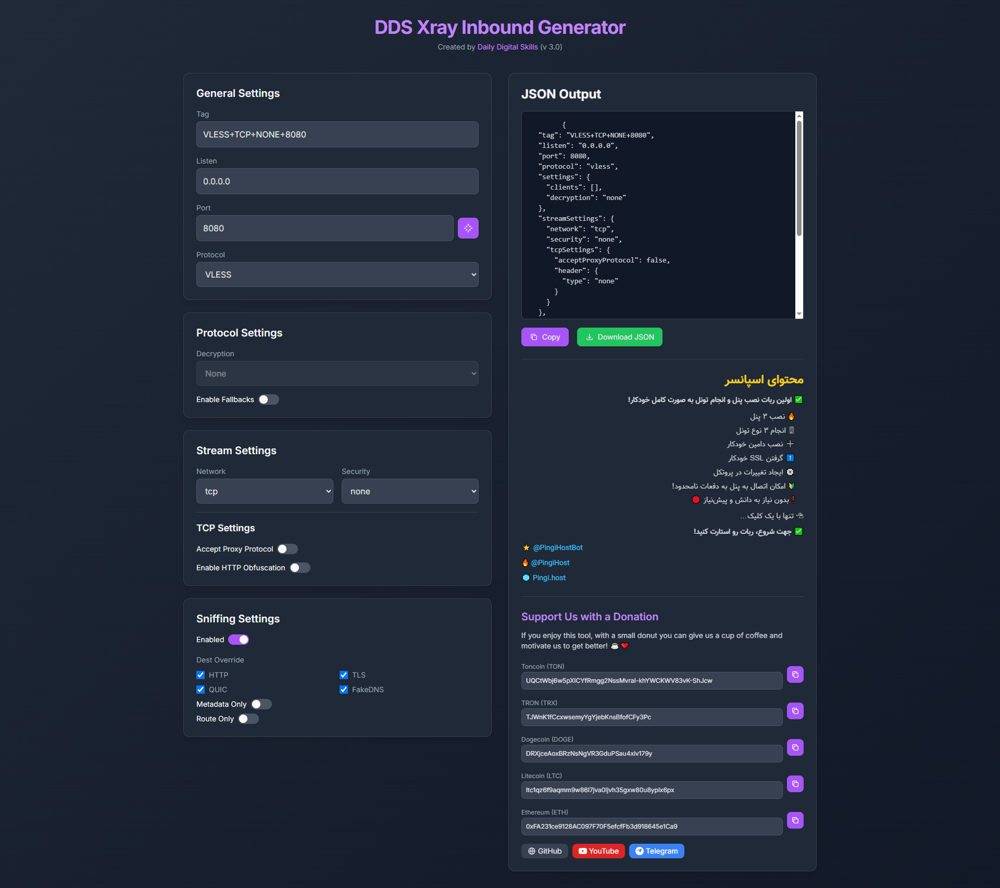

# DDS Xray Inbound Generator

  


A powerful and user-friendly web-based tool designed to generate Xray inbound configuration files in JSON format. Built with Vue.js and Tailwind CSS, this tool simplifies the process of creating configurations for various proxy protocols, making it accessible for both beginners and advanced users. Whether you're setting up a proxy server or experimenting with network configurations, DDS Xray Inbound Generator has you covered. Developed by [Daily Digital Skills](https://t.me/dailydigitalskills).

## Features

- **Interactive UI**: A modern, responsive interface with real-time JSON output generation.
- **Customizable Settings**: Fine-tune general settings, protocol-specific options, stream settings, and sniffing configurations.
- **Random Port Generation**: Easily generate a random port with a single click.
- **JSON Output**: View, copy, or download the generated configuration as a JSON file.
- **Multi-Language Support**: Includes styling support for Persian (Vazir font) alongside English.
- **Fade-In Animations**: Smooth UI transitions for a polished user experience.
- **Sponsor Section**: Integrated sponsor content with Telegram bot promotion (in Persian).
- **Donation Support**: Encourage contributions with cryptocurrency wallet addresses.

## Supported Protocols

The tool supports a wide range of proxy protocols, each with customizable settings:

- **Dokodemo-door**: Flexible inbound proxy with address, port, and network options (TCP/UDP).
- **VMESS**: A versatile protocol with stream settings and security options.
- **VLESS**: Lightweight protocol with decryption and fallback support.
- **Shadowsocks**: Secure protocol with multiple encryption methods (e.g., AES-256-GCM, CHACHA20).
- **Trojan**: Stealthy protocol with TLS and stream settings.
- **HTTP**: Basic HTTP proxy with account management.
- **SOCKS**: SOCKS5 proxy with authentication and UDP support.
- **Wireguard**: Modern VPN protocol with peer configuration.

## Stream Settings

For protocols that support it (e.g., VMESS, VLESS, Trojan), you can configure advanced stream settings:

- **Network Types**: TCP, WebSocket (ws), HTTP Upgrade, SplitHTTP, XHTTP, gRPC, HTTP/2, KCP.
- **Security Options**: None, TLS, Reality.
- **TLS Settings**: Server name, ALPN, certificates, and fingerprint simulation (e.g., Chrome, Firefox).
- **Reality Settings**: Private/public key generation, short IDs, and uTLS fingerprinting.
- **Protocol-Specific Options**: HTTP obfuscation, WebSocket headers, KCP tuning, etc.

## Sniffing Settings

Enhance routing with sniffing capabilities:

- Enable/disable sniffing.
- Destination override options: HTTP, TLS, QUIC, FakeDNS.
- Metadata-only and route-only modes.

## How to Use

1. **Clone the Repository**:
   ```bash
   git clone https://github.com/azavaxhuman/DDS-Xray-Inbound-Generator.git
   ```

OR

1. **Download the Repository**.

THEN

2. Open `index.html` in a modern web browser.
3. No additional setup or server is required as it runs entirely client-side.

### Configure Settings

- Fill in the "General Settings" (Tag, Listen, Port, Protocol).
- Adjust protocol-specific and stream settings as needed.
- Enable sniffing if required.

### Generate Output

- The JSON configuration updates in real-time on the right panel.
- Use the "Copy" button to copy it to your clipboard or "Download JSON" to save it as a file.

## Dependencies

- **[Vue.js v3](https://vuejs.org/)**: For reactive UI components.
- **[Tailwind CSS](https://tailwindcss.com/)**: For styling and responsive design.
- **Fonts**:
  - [Inter](https://fonts.google.com/specimen/Inter) and [Fira Code](https://fonts.google.com/specimen/Fira+Code) for English text.
  - [Vazir](https://fonts.google.com/specimen/Vazir) for Persian text.

## Sponsor

This project includes a sponsor section promoting a Telegram bot (`@PingiHostBot`) for automated panel installation and tunneling. Features include:

- Installation of 3 panel types.
- 3 types of tunneling.
- Automatic domain and SSL setup.
- Unlimited panel connections.
- No prior knowledge required.

Check it out:

- Telegram Bot: [@PingiHostBot](https://t.me/PingiHostBot)
- Channel: [@PingiHost](https://t.me/PingiHost)
- Website: [pingi.host](https://pingi.host)

## Support Us with a Donation

If you find this tool helpful, consider supporting us with a small donation! Your contribution helps us keep improving and fuels our coffee supply ☕❤️. Below are our wallet addresses:

| Cryptocurrency    | Wallet Address                                   |
| ----------------- | ------------------------------------------------ |
| TONcoin (TON)     | UQCtWbj6w5pXICYfRmgg2NssMvral-khYWCKWV83vK-ShJcw |
| DogeCoin (DOGE)   | DRXjceAoxBRzNsNgVR3GduPSau4xiv179y               |
| TRON (TRX-TRC20 ) | TJWnK1fCcxwsemyYgYjebKnsBfofCFy3Pc               |

To copy an address, click the button next to it in the UI.

## Connect with Us

- **GitHub**: [azavaxhuman](https://github.com/azavaxhuman/)
- **YouTube**: [@dailydigitalskills](https://youtube.com/@dailydigitalskills)
- **Telegram**: [@dailydigitalskills](https://t.me/dailydigitalskills)

## Contributors

We would like to extend our heartfelt thanks to all the contributors who have helped make this project possible. Your time, effort, and expertise are greatly appreciated! ❤️

### Special Thanks To:

- All the amazing developers and testers who provided feedback and suggestions.

If you'd like to contribute to this project, feel free to submit a pull request or open an issue on [GitHub](https://github.com/azavaxhuman/DDS-Xray-Inbound-Generator). We welcome all contributions!

## License

This project is open-source and available under the [MIT License](LICENSE). Feel free to use, modify, and distribute it as you see fit!
